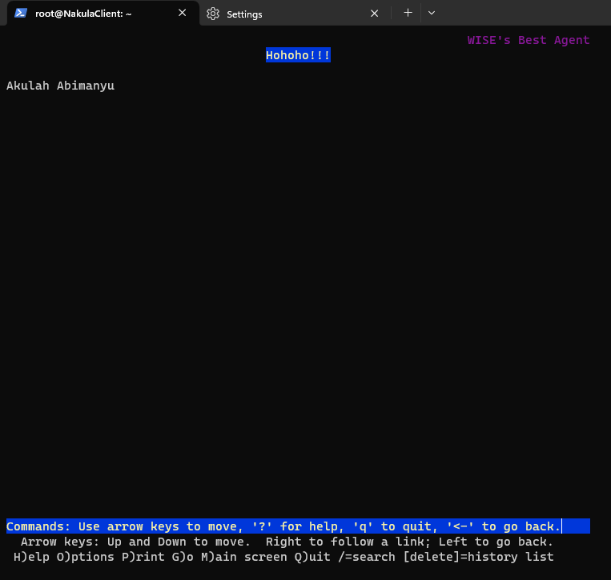

# Jarkom-Modul-2-B17-2023
---
Nama Anggota
1. Abdullah Nasih Jasir (5025211111)
2. Yohanes Teguh Ukur Ginting (5025211179)
---
## Soal 1
Yudhistira akan digunakan sebagai DNS Master, Werkudara sebagai DNS Slave, Arjuna merupakan Load Balancer yang terdiri dari beberapa Web Server yaitu Prabakusuma, Abimanyu, dan Wisanggeni. Buatlah topologi dengan pembagian sebagai berikut. Folder topologi dapat diakses pada drive berikut

#### Konfigurasi
*Di Router*

	auto eth0
	iface eth0 inet dhcp
	
	auto eth1
	iface eth1 inet static
		address 10.17.1.1
		netmask 255.255.255.0
	
	auto eth2
	iface eth2 inet static
		address 10.17.2.1
		netmask 255.255.255.0
	
	auto eth3
	iface eth3 inet static
		address 10.17.3.1
		netmask 255.255.255.0

#### Jawaban


---
## Soal 2
Buatlah website utama pada node arjuna dengan akses ke arjuna.yyy.com dengan alias www.arjuna.yyy.com dengan yyy merupakan kode kelompok.

#### Konfigurasi
*Di Node Yudhistira*

    apt-get update
    apt-get install bind9 -y
    cp -r -f /root/prak1/bind /etc/
    service bind9 restart

    nano /etc/bind/named.conf.local

    zone "arjuna.b17.com" {
	    type master;
	    file "/etc/bind/jarkom/arjuna.b17.com";
    };

    mkdir /etc/bind/jarkom

    cp /etc/bind/db.local /etc/bind/jarkom/arjuna.b17.com
    nano /etc/bind/jarkom/arjuna.b17.com  

    ((ganti menjadi arjuna.b17.com)
    ((ganti ip (10.17.1.4)))
    ((Tambahkan www	IN	CNAME	arjuna.b17.com.))

    service bind9 restart

*Di Node Nakula*

    echo nameserver 10.17.2.2 > /etc/resolv.conf
    ping www.arjuna.b17.com

#### Jawaban


---
## Soal 3
Dengan cara yang sama seperti soal nomor 2, buatlah website utama dengan akses ke abimanyu.yyy.com dan alias www.abimanyu.yyy.com.

#### Konfigurasi
*Di Node Yudhistira*

    nano /etc/bind/named.conf.local

    zone "abimanyu.b17.com" {
	    type master;
	    file "/etc/bind/jarkom/abimanyu.b17.com";
    };

    cp /etc/bind/db.local /etc/bind/jarkom/abimanyu.b17.com

    nano /etc/bind/jarkom/abimanyu.b17.com

    ((ganti nama menjadi abimanyu.b17.com))
    ((ganti IP (10.17.3.3)))
    ((Tambahkan www	IN	CNAME	abimanyu.b17.com.))
    
    service bind9 restart

*Di Node Nakula*

    echo nameserver 10.17.2.2 > /etc/resolv.conf (DIULANG) 
    ping www.abimanyu.b17.com

#### Jawaban


---

## Soal 4
Kemudian, karena terdapat beberapa web yang harus di-deploy, buatlah subdomain parikesit.abimanyu.yyy.com yang diatur DNS-nya di Yudhistira dan mengarah ke Abimanyu.

#### Konfigurasi
*Di Node Yudhistira*

    nano /etc/bind/jarkom/abimanyu.b17.com
    
    ((Tambahkan))
    parikesit	IN	A	10.17.3.3
    service bind9 restart

*Di Node Nakula*
    
    ping parikesit.abimanyu.b17.com

#### Jawaban


---

## Soal 5
Buat juga reverse domain untuk domain utama. (Abimanyu saja yang direverse)

#### Konfigurasi
*Di Node Yudhistira*
  
    nano /etc/bind/named.conf.local

    zone "3.17.10.in-addr.arpa" {
      type master;
      file "/etc/bind/jarkom/3.17.10.in-addr.arpa";
    };

    cp /etc/bind/db.local /etc/bind/jarkom/3.17.10.in-addr.arpa

    nano /etc/bind/jarkom/3.17.10.in-addr.arpa

    ((Tambahkan))
    3.17.10.in-addr.arpa.	IN	NS	abimanyu.b17.com.
    3			IN	PTR	abimanyu.b17.com.

    service bind9 restart

*Di Node Nakula*

    echo nameserver 192.168.122.1 > /etc/resolv.conf
    apt-get update
    apt-get install dnsutils
    echo nameserver 10.17.2.2 > /etc/resolv.conf
    host -t PTR 10.17.3.3 (punya abimanyu)

#### Jawaban


---

## Soal 6
Agar dapat tetap dihubungi ketika DNS Server Yudhistira bermasalah, buat juga Werkudara sebagai DNS Slave untuk domain utama.

#### Konfigurasi
*Di Node Yudhistira*

    nano /etc/bind/named.conf.local

    ((Pada setiap zone (kecuali reverse), tambahkan))
    also-notify { 10.17.2.3; }; // IP Werkudara
    allow-transfer { 10.17.2.3; }; // IP Werkudara

    service bind9 restart

*Di Node Werkudara*

    apt-get update
    apt-get install bind9 -y
    nano /etc/bind/named.conf.local

    zone "arjuna.b17.com" {
      type slave;
      masters { 10.17.2.2; };
      file "/var/lib/bind/arjuna.b17.com";
    };

    zone "abimanyu.b17.com" {
      type slave;
      masters { 10.17.2.2; }; 
      file "/var/lib/bind/abimanyu.b17.com";
    };

    service bind9 restart

*Di Node Yudhistira*

    service bind9 stop

*Di Node Nakula*

    nano /etc/resolv.conf
    nameserver 10.17.2.2
    nameserver 10.17.2.3

    ping www.arjuna.b17.com
    ping www.abimanyu.b17.com

#### Jawaban


---

## Soal 7
Seperti yang kita tahu karena banyak sekali informasi yang harus diterima, buatlah subdomain khusus untuk perang yaitu baratayuda.abimanyu.yyy.com dengan alias www.baratayuda.abimanyu.yyy.com yang didelegasikan dari Yudhistira ke Werkudara dengan IP menuju ke Abimanyu dalam folder Baratayuda.

#### Konfigurasi
*Di Yudhistira*

	  nano /etc/bind/jarkom/abimanyu.b17.com

	  ((Tambahkan))
	  ns1	IN	A	10.17.3.3
	  baratayuda	IN	NS	ns1

	  nano /etc/bind/named.conf.options

	  comment //dnsec
	  allow-query{any;};

	  service bind9 restart

*Di Node Werkudara*

	nano /etc/bind/named.conf.options
 
    comment //dnsec
    allow-query{any;};

	  nano /etc/bind/named.conf.local
      
    zone "baratayuda.abimanyu.b17.com" {
      type master;
      file "/etc/bind/Baratayuda/baratayuda.abimanyu.b17.com";
    };

	  mkdir /etc/bind/Baratayuda

    cp /etc/bind/db.local /etc/bind/Baratayuda/baratayuda.abimanyu.b17.com
	
	  nano  /etc/bind/Baratayuda/baratayuda.abimanyu.b17.com

	  ((ganti nama menjadi baratayuda.abimanyu.b17.com))
	  ((ganti IP abimanyu))
	  ((ganti AAAA jadi www	IN	A	10.17.3.3))

	  service bind9 restart

*Di Node Nakula*

  	nano /etc/resolv.conf

    nameserver 10.17.2.2
    nameserver 10.17.2.3	

    ping www.baratayuda.abimanyu.b17.com

#### Jawaban


---

## Soal 8
Untuk informasi yang lebih spesifik mengenai Ranjapan Baratayuda, buatlah subdomain melalui Werkudara dengan akses rjp.baratayuda.abimanyu.yyy.com dengan alias www.rjp.baratayuda.abimanyu.yyy.com yang mengarah ke Abimanyu.

#### Konfigurasi
*Di Node Werkudara*

    nano /etc/bind/Baratayuda/baratayuda.abimanyu.b17.com

    ((Tambahkan))
    rjp	IN	A	10.17.3.3
    www.rjp	IN	CNAME	rjp

    service bind9 restart

*Di Node Nakula*

    ping www.rjp.baratayuda.abimanyu.b17.com

#### Jawaban


---

## Soal 9
Arjuna merupakan suatu Load Balancer Nginx dengan tiga worker (yang juga menggunakan nginx sebagai webserver) yaitu Prabakusuma, Abimanyu, dan Wisanggeni. Lakukan deployment pada masing-masing worker.

#### Konfigurasi
*Di Router*
    
    apt-get update
    apt-get install nginx -y
    service nginx start

*Di Node Yudhistira*
    
    apt-get install bind9 nginx -y
    service nginx start

*Di Node Prabukusuma/Wisangeni/Abimanyu*
  
    apt-get update && apt install nginx php php-fpm -y
    mkdir /var/www/jarkom

	  nano /var/www/jarkom/index.php

—---------------------------------------------(MILIH)------------------------------------------------------
    	
     <?php
    echo "Halo, Kamu berada di Prabukusuma";
     	?>
    
    	<?php
    echo "Halo, Kamu berada di Abimanyu";
     	?>
    
    	<?php
    echo "Halo, Kamu berada di Wisanggeni";
     	?>
—---------------------------------------------(MILIH)------------------------------------------------------
	 
     nano /etc/nginx/sites-available/jarkom

—---------------------------------------------(MILIH)------------------------------------------------------
	
     server {
     	listen 8001;
     	root /var/www/jarkom;
     	index index.php index.html index.htm;
     	server_name _;
     	location / {
     			try_files $uri $uri/ /index.php?$query_string;
     	}
     	# pass PHP scripts to FastCGI server
     	location ~ \.php$ {
     	include snippets/fastcgi-php.conf;
     	fastcgi_pass unix:/var/run/php/php7.0-fpm.sock;
     	}
    location ~ /\.ht {
     			deny all;
     	}
     	error_log /var/log/nginx/jarkom_error.log;
     	access_log /var/log/nginx/jarkom_access.log;
     	}
    
    	server {
     	listen 8002;
     	root /var/www/jarkom;
     	index index.php index.html index.htm;
     	server_name _;
     	location / {
     			try_files $uri $uri/ /index.php?$query_string;
     	}
     	# pass PHP scripts to FastCGI server
     	location ~ \.php$ {
     	include snippets/fastcgi-php.conf;
     	fastcgi_pass unix:/var/run/php/php7.0-fpm.sock;
     	}
    location ~ /\.ht {
     			deny all;
     	}
     	error_log /var/log/nginx/jarkom_error.log;
     	access_log /var/log/nginx/jarkom_access.log;
     	}
    
    	server {
     	listen 8003;
     	root /var/www/jarkom;
     	index index.php index.html index.htm;
     	server_name _;
     	location / {
     			try_files $uri $uri/ /index.php?$query_string;
     	}
     	# pass PHP scripts to FastCGI server
     	location ~ \.php$ {
     	include snippets/fastcgi-php.conf;
     	fastcgi_pass unix:/var/run/php/php7.0-fpm.sock;
     	}
    location ~ /\.ht {
     			deny all;
     	}
     	error_log /var/log/nginx/jarkom_error.log;
     	access_log /var/log/nginx/jarkom_access.log;
     	}

—---------------------------------------------(MILIH)------------------------------------------------------

    ln -s /etc/nginx/sites-available/jarkom /etc/nginx/sites-enabled

    service nginx start
	  service php7.0-fpm start

    nginx -t

---

## Soal 10
Kemudian gunakan algoritma Round Robin untuk Load Balancer pada Arjuna. Gunakan server_name pada soal nomor 1. Untuk melakukan pengecekan akses alamat web tersebut kemudian pastikan worker yang digunakan untuk menangani permintaan akan berganti ganti secara acak. Untuk webserver di masing-masing worker wajib berjalan di port 8001-8003. Contoh
    - Prabakusuma:8001
    - Abimanyu:8002
    - Wisanggeni:8003

#### Konfigurasi
*Di Node Arjuna*

    cp -r -f /etc/nginx /root/prak1/ (PENTING)
	  cp -r -f /root/prak1/nginx /etc/

    apt-get update
    apt-get install bind9 nginx -y

    nano /etc/nginx/sites-available/lb-jarkom
  
    upstream myweb {
      server 10.17.3.2:8001;
      server 10.17.3.3:8002;
      server 10.17.3.4:8003;
    }
    
    server {
      listen 80;
      server_name arjuna.b17.com;
    
      location / {
        proxy_pass http://myweb;
      }
    }

    ln -s /etc/nginx/sites-available/lb-jarkom /etc/nginx/sites-enabled

    service nginx start
    service nginx restart

*Di Node Nakula*
    
    apt-get install lynx -y
    nano /etc/resolv.conf

    nameserver 10.17.2.2
    nameserver 10.17.2.3	

    lynx http://arjuna.b17.com

#### Jawaban


---
---

## Nomor 11
###### Selain menggunakan Nginx, lakukan konfigurasi Apache Web Server pada worker Abimanyu dengan web server www.abimanyu.yyy.com. Pertama dibutuhkan web server dengan DocumentRoot pada /var/www/abimanyu.yyy

#### Penyelesaian
Melakukan instalasi apache2 dan melakukan konfigurasi dalam file `/etc/apache2/sites-available/abimanyu.b17.com.conf`
```
apt-get update
apt-get install apache2
cp 000-default.conf abimanyu.b17.com.conf
```
menjadi seperti ini

Lalu pada directory `/var/www` buat directory untuk file webserver yaitu abimanyu.b17
```
mkdir /var/www/abimanyu.b17
```
Lalu untuk mengetes apakah berhasil lakukan `lynx abimanyu.b17.com` dari client dan memiliki tampilan sebagai berikut


## Nomor 12
###### Setelah itu ubahlah agar url www.abimanyu.yyy.com/index.php/home menjadi www.abimanyu.yyy.com/home.

#### Penyelesaian
Lakukan konfigurasi dalam file `/etc/apache2/sites-available/abimanyu.b17.com.conf` dengan menambahkan
```
Alias "/home" "/var/www/abimanyu.b17/index.php/home"
```
menjadi 

Lalu untuk mengetes apakah berhasil lakukan `lynx abimanyu.b17.com/home` dari client dan memiliki tampilan sebagai berikut


## Nomor 13
###### Selain itu, pada subdomain www.parikesit.abimanyu.yyy.com, DocumentRoot disimpan pada /var/www/parikesit.abimanyu.yyy

#### Penyelesaian
Lakukan hal yang sama dengan nomor 11 tetapi dengan penamaan file `/etc/apache2/sites-available/parikesit.abimanyu.b17.com.conf` menjadi


Lalu untuk mengetes apakah berhasil lakukan `lynx parikesit.abimanyu.b17.com` dari client dan memiliki tampilan sebagai berikut


## Nomor 14
###### Pada subdomain tersebut folder /public hanya dapat melakukan directory listing sedangkan pada folder /secret tidak dapat diakses (403 Forbidden)

#### Penyelesaian
Lakukan konfigurasi pada file `/etc/apache2/sites-available/parikesit.abimanyu.b17.com.conf` menjadi


Lalu untuk mengetes apakah berhasil lakukan `lynx parikesit.abimanyu.b17.com/public` dari client dan memiliki tampilan sebagai berikut

Lalu untuk mengetes apakah berhasil lakukan `lynx parikesit.abimanyu.b17.com/secret` dari client dan memiliki tampilan sebagai berikut


## Nomor 15
###### Buatlah kustomisasi halaman error pada folder /error untuk mengganti error kode pada Apache. Error kode yang perlu diganti adalah 404 Not Found dan 403 Forbidden.

#### Penyelesaian
Buat file `.htaccess` pada directory `/var/www/parikesit.abimanyu.b17` dan tuliskan 
```
 RewriteEngine On
 RewriteCond %{REQUEST_FILENAME} !-d
 RewriteRule ^([^\.]+)$ $1.php [NC,L]
 RewriteRule ^.abimanyu.\.(jpg|jpeg|png|gif)$ /abimanyu.png [L,R=301]
 ErrorDocument 404 /error/404.html
 ErrorDocument 403 /error/403.html
```

Lakukan konfigurasi pada file `/etc/apache2/sites-available/parikesit.abimanyu.b17.com.conf` menjadi

Lalu untuk mengetes apakah berhasil lakukan `lynx parikesit.abimanyu.b17.com/teguh` dari client karena tidak ada dan memiliki tampilan sebagai berikut

Lalu untuk mengetes apakah berhasil lakukan `lynx parikesit.abimanyu.b17.com/secret` dari client karena tidak ada dan memiliki tampilan sebagai berikut


## Nomor 16
###### Buatlah suatu konfigurasi virtual host agar file asset www.parikesit.abimanyu.yyy.com/public/js menjadi www.parikesit.abimanyu.yyy.com/js 


#### Penyelesaian
Lakukan konfigurasi pada file `/etc/apache2/sites-available/parikesit.abimanyu.b17.com.conf` dengan menambahkan 
```
Alias "/js" "/var/www/parikesit.abimanyu.b17/public/js"
```
sehingga menjadi 

Lalu untuk mengetes apakah berhasil lakukan `lynx parikesit.abimanyu.b17.com/js` dari client karena tidak ada dan memiliki tampilan sebagai berikut


## Nomor 17
###### Agar aman, buatlah konfigurasi agar www.rjp.baratayuda.abimanyu.yyy.com hanya dapat diakses melalui port 14000 dan 14400.


#### Penyelesaian
Buat file konfigurasi seperti soal nomor 11 dan lakukan konfigurasi pada file `/etc/apache2/sites-available/rjp.baratayuda.abimanyu.b17.com.conf` sebagai berikut

lalu edit konfigurasi pada file `/etc/apache2/ports.conf` dengan menambahkan
```
Listen 14000
Listen 14400
```
Agar port yang dilisten port `14000` dan `14400`


Lalu untuk mengetes apakah berhasil lakukan `lynx rjp.baratayuda.abimanyu.b17.com:14000` atau `lynx rjp.baratayuda.abimanyu.b17.com:14400` dari client karena tidak ada dan memiliki tampilan sebagai berikut


## Nomor 18
###### Untuk mengaksesnya buatlah autentikasi username berupa “Wayang” dan password “baratayudayyy” dengan yyy merupakan kode kelompok. Letakkan DocumentRoot pada /var/www/rjp.baratayuda.abimanyu.yyy.


#### Penyelesaian
Buat file konfigurasi `.htpasswd` pada directory `/var/www/rjp.baratayuda.abimanyu.b17` dengan command
```
htpasswd -c .htpasswd Wayang baratayudab17
```
lalu edit file konfigurasi pada `/etc/apache2/sites-available/rjp.baratayuda.abimanyu.b17.com.conf` menjadi 

dengan menambahkan 
```
<Directory /var/www/rjp.baratayuda.abimanyu.b17>
        AuthType Basic
        AuthName "Autentikasi dulu dong"
        AuthUserFile /var/www/rjp.baratayuda.abimanyu.b17/.htpasswd
        Require user Wayang
</Directory>
```

Lalu untuk mengetes apakah berhasil lakukan `lynx -auth=Wayang:baratayudab17 rjp.baratayuda.abimanyu.b17.com:14000` karena memerlukan autorisasi untuk login dan memiliki tampilan sebagai berikut


## Nomor 19
###### Buatlah agar setiap kali mengakses IP dari Abimanyu akan secara otomatis dialihkan ke www.abimanyu.yyy.com (alias)


#### Penyelesaian
Lakukan konfigurasi pada file `/etc/apache2/sites-available/abimanyu.b17.com.conf` dengan manambahkan di paling bawah 
```
<VirtualHost *:80>
        ServerAdmin webmaster@localhost
        DocumentRoot /var/www/abimanyu.b17
        ServerName 10.17.3.3
        ServerAlias 10.17.3.3
        Redirect permanent / http://www.abimanyu.b17.com/
</VirtualHost>
```
sehingga menjadi 

Lalu untuk mengetes apakah berhasil lakukan `lynx 10.17.3.3` dan memiliki tampilan sebagai berikut


## Nomor 20
###### Karena website www.parikesit.abimanyu.yyy.com semakin banyak pengunjung dan banyak gambar gambar random, maka ubahlah request gambar yang memiliki substring “abimanyu” akan diarahkan menuju abimanyu.png.

#### Penyelesaian
*Di Node Abimanyu*

	a2enmod rewrite

	echo 'RewriteEngine On
	RewriteCond %{REQUEST_URI} ^/public/images/(.*)(abimanyu)(.*\.(png|jpg))
	RewriteCond %{REQUEST_URI} !/public/images/abimanyu.png
	RewriteRule abimanyu http://parikesit.abimanyu.b17.com/public/images/abimanyu.png$1 [L,R=301]' > /var/www/parikesit.abimanyu.b17/.htaccess

Lalu jalankan konfigurasi berikut

	echo -e '<VirtualHost *:80>
	  ServerAdmin webmaster@localhost
	  DocumentRoot /var/www/parikesit.abimanyu.b17
	
	  ServerName parikesit.abimanyu.b17.com
	  ServerAlias www.parikesit.abimanyu.b17.com
	
	  <Directory /var/www/parikesit.abimanyu.b17/public>
	          Options +Indexes
	  </Directory>
	
	  <Directory /var/www/parikesit.abimanyu.b17/secret>
	          Options -Indexes
	  </Directory>
	
	  <Directory /var/www/parikesit.abimanyu.b17>
	          Options +FollowSymLinks -Multiviews
	          AllowOverride All
	  </Directory>
	
	  Alias "/public" "/var/www/parikesit.abimanyu.b17/public"
	  Alias "/secret" "/var/www/parikesit.abimanyu.b17/secret"
	  Alias "/js" "/var/www/parikesit.abimanyu.b17/public/js"
	
	  ErrorDocument 404 /error/404.html
	  ErrorDocument 403 /error/403.html
	
	  ErrorLog ${APACHE_LOG_DIR}/error.log
	  CustomLog ${APACHE_LOG_DIR}/access.log combined
	</VirtualHost>' > /etc/apache2/sites-available/parikesit.abimanyu.b17.com.conf

	service apache2 restart

Lakukan test di Node Client Nakula

	lynx parikesit.abimanyu.b17.com/public/images/not-abimanyu.png
	lynx parikesit.abimanyu.b17.com/public/images/abimanyu-student.jpg
	lynx parikesit.abimanyu.b17.com/public/images/abimanyu.png
	lynx parikesit.abimanyu.b17.com/public/images/notabimanyujustmuseum.177013

 
 
